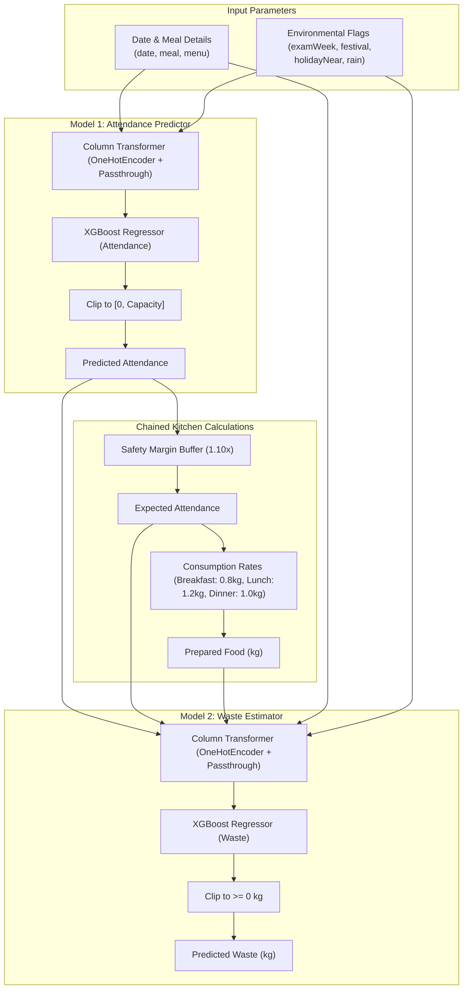

# Mess Forecasting & Food Waste Prediction Pipeline 🍲

This directory contains the machine learning pipeline used to forecast student mess attendance and predict daily food waste. By using sequential predictions, the kitchen administration can optimize ingredient purchasing, reduce carbon footprints, and save costs.

---

## 📐 Architecture & Chained Prediction Flow

Instead of predicting waste directly from the date, we use a **chained (two-stage) regressor system** that models the decision pipeline of the kitchen staff.



---

## 🧠 Model Breakdown

### Model 1: Attendance Prediction Model
Model 1 uses a tabular dataset to learn student attendance patterns based on calendar events, food menu quality, and weather.

* **Target Variable**: `Attendance` (Integer value capped at the hostel capacity)
* **Categorical Features** (One-Hot Encoded):
  * `DayOfWeek` (e.g., Sunday, Monday)
  * `Meal` (Breakfast, Lunch, Dinner)
  * `Menu` (e.g., "Butter Chicken & Naan", "Idli Sambar")
* **Numerical & Binary Features** (Passthrough):
  * `Month` (1-12)
  * `SemesterWeek` (1-20 representing the week of the academic calendar)
  * `Weekend` (0/1)
  * `Capacity` (Hostel capacity, varies by year & summer terms)
  * `ExamWeek`, `MidSem`, `EndSem` (0/1)
  * `Festival` (0/1)
  * `HolidayTomorrow`, `HolidayAfter2Days`, `HolidayNear` (0/1)
  * `Rain` (0/1)

### Intermediate Chained Calculations
To replicate real-world catering buffers, the output of Model 1 is piped through the following formulas:
1. **Expected Attendance**:
   $$\text{Expected Attendance} = \text{Predicted Attendance} \times 1.10$$
   *(Includes a $10\%$ safety buffer to prevent food shortages)*
2. **Prepared Food (kg)**:
   $$\text{Prepared Food} = \text{Expected Attendance} \times \text{Consumption Rate}$$
   * **Breakfast**: $0.8\text{ kg/student}$
   * **Lunch**: $1.2\text{ kg/student}$
   * **Dinner**: $1.0\text{ kg/student}$

### Model 2: Food Waste Prediction Model
Model 2 estimates the resulting food waste in kilograms, matching predicted prep amounts against raw variables.

* **Target Variable**: `Waste_kg` (Continuous float $\ge 0$)
* **Input Features**:
  * Output values: `PredictedAttendance`, `PredictedExpectedAttendance`, `PredictedPreparedFood_kg` (all cast to `float32`)
  * Original variables: `Meal`, `Menu`, `ExamWeek`, `MidSem`, `EndSem`, `Festival`, `HolidayNear`, `Rain`

---

## 🛠️ File Structure

* **[generate_data.py](file:///home/jemin/Projects/design/WebForge/mess-model/generate_data.py)**: Generates a realistic synthetic meal and attendance history dataset based on day effects, weather anomalies, exam stressors, and holidays. Saves to `meal_summary.csv`.
* **[meal_summary.csv](file:///home/jemin/Projects/design/WebForge/mess-model/meal_summary.csv)**: 365-day dataset containing historical columns.
* **[train_pipeline.py](file:///home/jemin/Projects/design/WebForge/mess-model/train_pipeline.py)**: Trains the XGBoost pipelines using Scikit-Learn and converts the output models to **ONNX** format (`attendance_model.onnx`, `waste_model.onnx`).
* **[train_pkl.py](file:///home/jemin/Projects/design/WebForge/mess-model/train_pkl.py)**: Trains identical pipelines but exports them to serialized **Pickle** format (`attendance_model.pkl`, `waste_model.pkl`) inside the backend folder for immediate use by the FastAPI service.

---

## 🏃 Run & Train Instructions

### Prerequisites
Activate your Python virtual environment and ensure you have all requirements installed:
```bash
pip install pandas numpy xgboost scikit-learn joblib skl2onnx onnxmltools
```

### 1. Re-generate Synthetic Data (Optional)
If you want to modify the data distribution, run the generator script:
```bash
python generate_data.py
```
This generates `meal_summary.csv`.

### 2. Train Models (Pickle Serialization)
To train the XGBoost models and export them directly to the `backend/` directory for the FastAPI app:
```bash
python train_pkl.py
```
This creates:
* `backend/attendance_model.pkl`
* `backend/waste_model.pkl`

### 3. Train Models (ONNX Serialization)
If you need standardized ONNX runtimes for cross-platform support:
```bash
python train_pipeline.py
```
This creates:
* `attendance_model.onnx`
* `waste_model.onnx`
