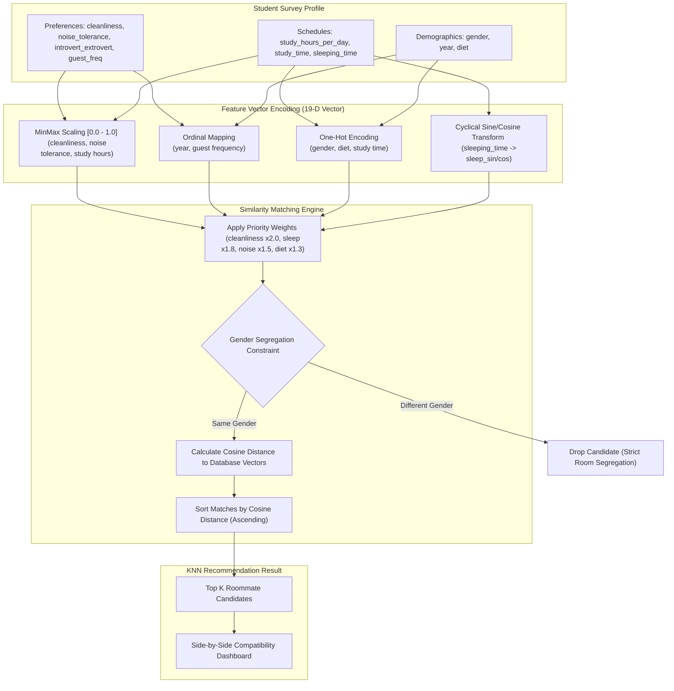

# AI-Powered Roommate Compatibility Engine 🤝

This directory contains the roommate recommendation engine. By analyzing students' sleeping cycles, cleanliness preferences, noise tolerances, study habits, and dietary choices, the engine matches compatible roommates to minimize conflicts and foster community.

---

## 🏗️ Matcher Architecture Flow

The matching system processes raw survey data, transforms it into a weighted 19-dimensional vector space, applies constraints, and calculates cosine distance against the roommate database.



---

## 📊 Feature Vector Design & Weights

To ensure high-quality matches, different questionnaire answers have different weights in the final vector. Features like cleanliness or sleeping time are marked as priority weights because they represent the most common roommate conflict points.

| Feature Name | Encoding Method | Source Range | Target Range | Matching Weight |
| :--- | :--- | :--- | :--- | :--- |
| **`cleanliness`** | MinMax Scaling | $[1, 5]$ | $[0.0, 1.0]$ | **$2.0$ (Dealbreaker)** |
| **`sleep_sin` / `sleep_cos`** | Cyclical Trans. | Hours $[0, 24]$ | $[-1.0, 1.0]$ | **$1.8$ (High Priority)** |
| **`noise_tolerance`** | MinMax Scaling | $[1, 5]$ | $[0.0, 1.0]$ | **$1.5$ (High Priority)** |
| **`diet_*`** (5 classes) | One-Hot | Categorical | $\{0.0, 1.0\}$ | **$1.3$ (Medium Priority)** |
| **`study_hours_per_day`** | MinMax Scaling | $[1, 10]$ | $[0.0, 1.0]$ | $1.0$ (Standard) |
| **`introvert_extrovert`** | MinMax Scaling | $[1, 5]$ | $[0.0, 1.0]$ | $1.0$ (Standard) |
| **`year`** | Ordinal Mapping | $\{1\text{st}, 2\text{nd}, 3\text{rd}, 4\text{th}\}$ | $\{0, 0.33, 0.67, 1.0\}$ | $1.0$ (Standard) |
| **`guest_freq`** | Ordinal Mapping | $\{\text{never, sometimes, often}\}$ | $\{0.0, 0.5, 1.0\}$ | $1.0$ (Standard) |
| **`gender_*`** (3 classes) | One-Hot | Categorical | $\{0.0, 1.0\}$ | $1.0$ (Standard) |
| **`study_time_*`** (3 classes) | One-Hot | Categorical | $\{0.0, 1.0\}$ | $1.0$ (Standard) |

---

## 🧮 Mathematical Model

### 1. Cyclical Sleep Cycle Transform
Representing clock time linearly (e.g. mapping "11:30 PM" to $23.5$ and "12:30 AM" to $0.5$) makes them appear far apart when they are actually close. We project the time onto a unit circle using Sine and Cosine transforms:
$$\text{Hour} = \text{parseTimeToHour}(\text{sleeping\_time})$$
$$\text{sleep\_sin} = \sin\left(\frac{2\pi \cdot \text{Hour}}{24}\right) \qquad \text{sleep\_cos} = \cos\left(\frac{2\pi \cdot \text{Hour}}{24}\right)$$

### 2. Weighted Cosine Distance
Once the vectors $\mathbf{u}$ and $\mathbf{v}$ are formed and multiplied by their feature weights, the similarity engine evaluates the angular difference between them:
$$d_{\text{cos}}(\mathbf{u}, \mathbf{v}) = 1 - \frac{\mathbf{u} \cdot \mathbf{v}}{\|\mathbf{u}\|_2 \|\mathbf{v}\|_2} = 1 - \frac{\sum_{i=1}^{D} u_i v_i}{\sqrt{\sum_{i=1}^{D} u_i^2} \sqrt{\sum_{i=1}^{D} v_i^2}}$$

### 3. Compatibility Percentage
The user dashboard displays this relationship as a percentage match:
$$\text{Compatibility (\%)} = \max\left(0, 1 - d_{\text{cos}}\right) \times 100$$

### 4. Strict Gender Segregation Constraint
Before running cosine distance, the engine filters the dataset. If the candidate's `gender` does not exactly match the query's `gender`, they are dropped immediately (boys and girls are housed in separate rooms/hostels).

---

## 🛠️ File Structure

* **[1_first_name.txt](file:///home/jemin/Projects/design/WebForge/roommate-model/1_first_name.txt) & [2_last_name.txt](file:///home/jemin/Projects/design/WebForge/roommate-model/2_last_name.txt)**: Text source catalogs containing first names and surnames used by the generator.
* **[generate_data.py](file:///home/jemin/Projects/design/WebForge/roommate-model/generate_data.py)**: Python script to generate synthetic, structured questionnaire records for 5,000 students. Saves output to `roommate_data.csv`.
* **[roommate_data.csv](file:///home/jemin/Projects/design/WebForge/roommate-model/roommate_data.csv)**: Unprocessed tabular survey dataset.
* **[encode_data.py](file:///home/jemin/Projects/design/WebForge/roommate-model/encode_data.py)**: Vectorization pipeline. It scales, ordinal-maps, one-hot encodes, cyclical-transforms, and weights features, saving the matrices to `roommate_encoded.csv` and details to `encoding_metadata.json`.
* **[encoding_metadata.json](file:///home/jemin/Projects/design/WebForge/roommate-model/encoding_metadata.json)**: JSON schema catalog capturing feature names, weights, and metrics configuration.
* **[inference.py](file:///home/jemin/Projects/design/WebForge/roommate-model/inference.py)**: Local KNN simulation script. Loads the datasets and runs compatibility queries, displaying a side-by-side terminal verification dashboard.

---

## 🏃 Run & Test Instructions

Run the model code locally to see matches in action:

1. **Step 1: Generate Raw Profiles** (Optional):
   ```bash
   python generate_data.py
   ```
2. **Step 2: Vectorize and Weights Pipeline**:
   ```bash
   python encode_data.py
   ```
3. **Step 3: Run Matcher Inference & Dashboard Simulator**:
   ```bash
   python inference.py
   ```
   This will output a comparative table in your terminal showing compatibility margins and ranks for both database matches and a custom testing profile:

   ```
   ===============================================================================================
    ROOMMATE COMPATIBILITY DASHBOARD FOR: NAMAN CHAUDHARY 
   ===============================================================================================
    Attribute          | Query Profile      | Rank 1: Abhishek S. (94.2%) | Rank 2: Priyanshu B. (92.8%) |
   -----------------------------------------------------------------------------------------------
    academic_year      | 3rd year           | 3rd year                    | 3rd year                     |
    gender             | Male               | Male                        | Male                         |
    diet               | veg                | veg                         | veg                          |
    cleanliness        | 4                  | 4                           | 3                            |
    sleeping_time      | 11:30 PM           | 11:00 PM                    | 12:00 AM                     |
    ...
   ```
